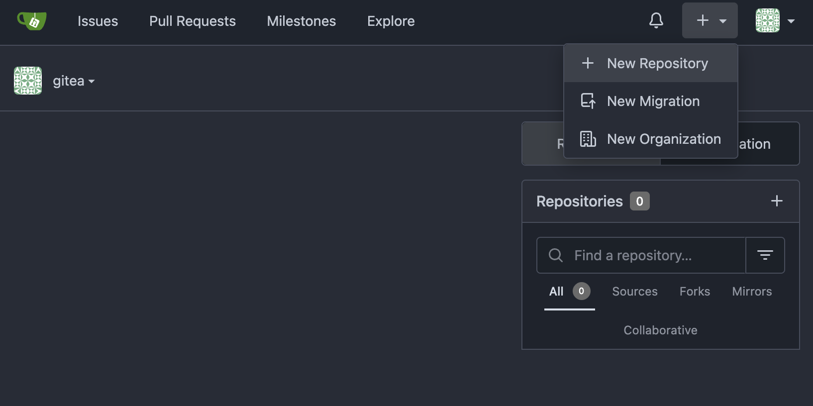
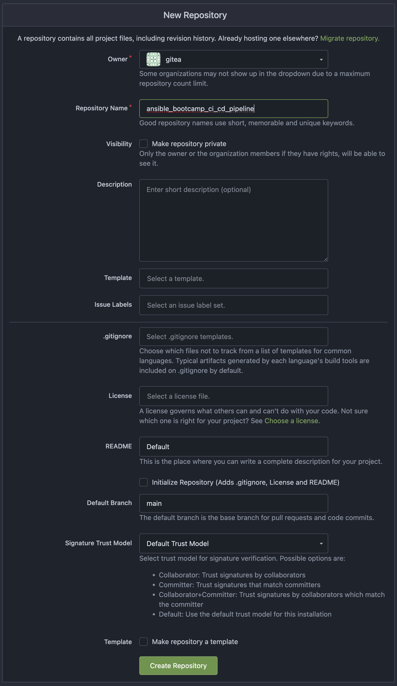
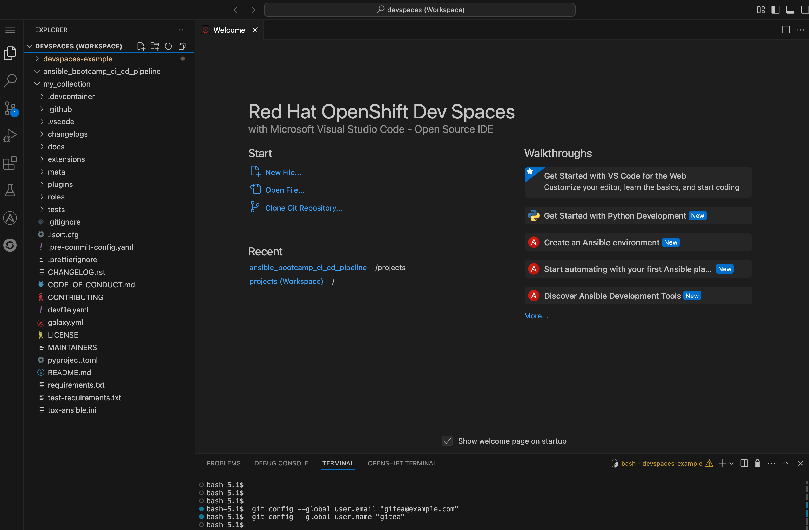
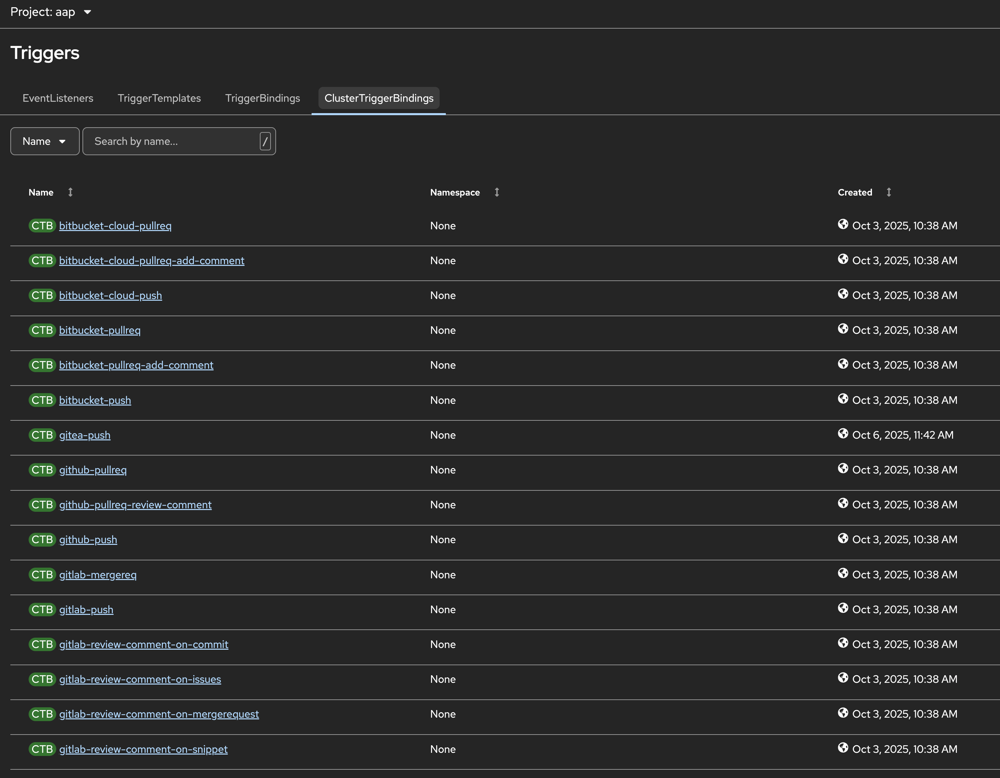
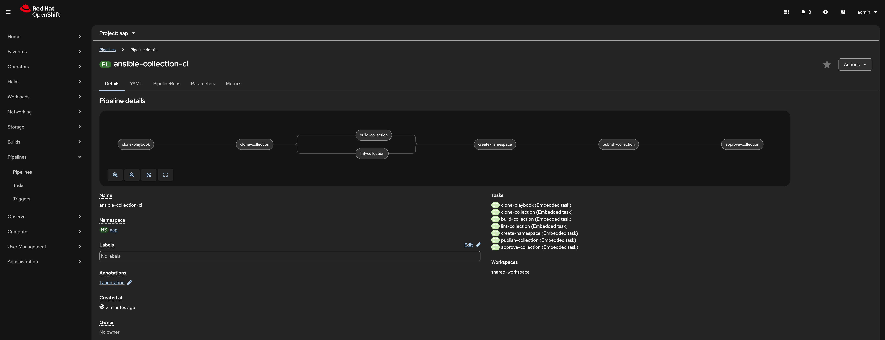
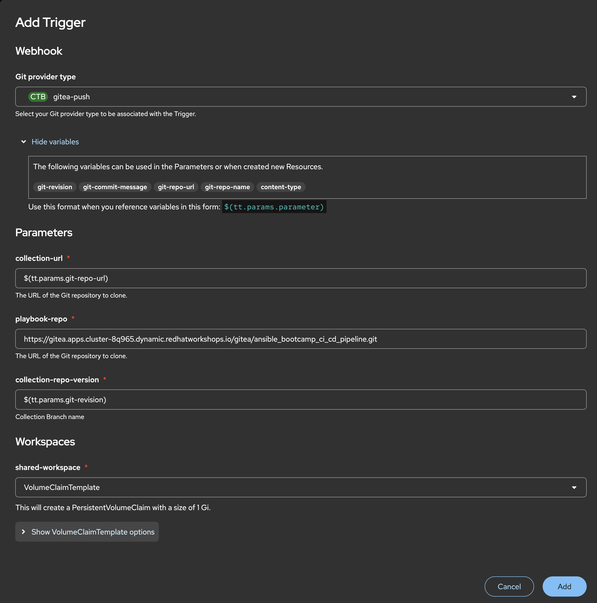
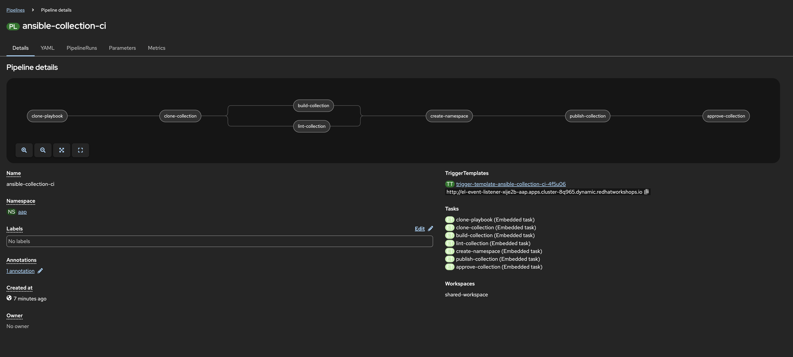
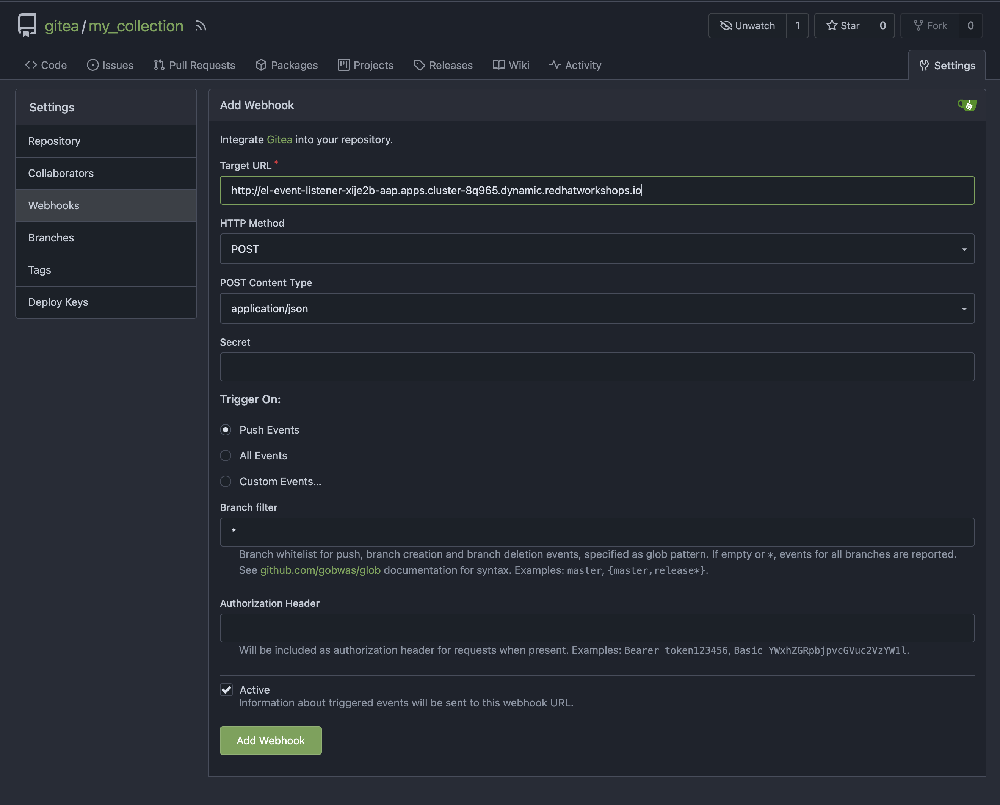
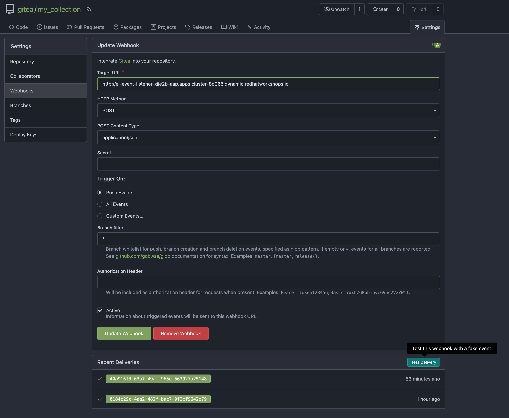
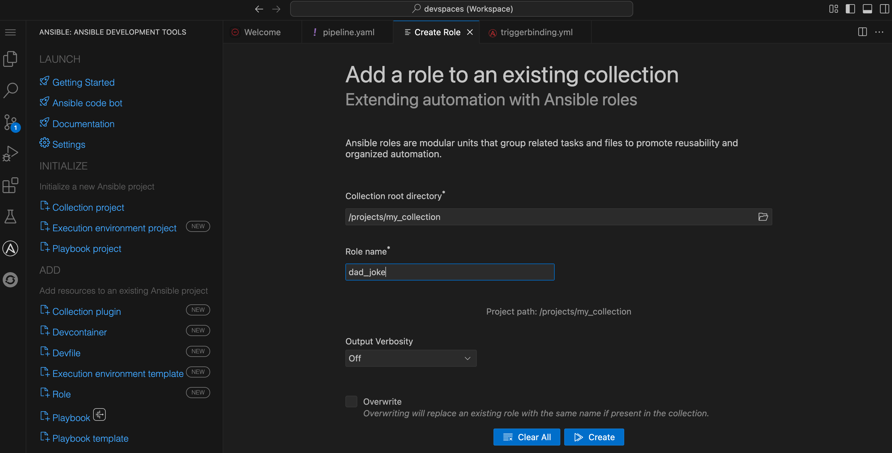

= Lab: Creating a CI/CD Pipeline

[abstract]
This template outlines the steps and considerations for a lab focused on developing and implementing a Continuous Integration/Continuous Delivery (CI/CD) pipeline using Tekton to automate the Ansible collection build and publish process into Automation Hub.

== 1. Prerequisites

.Particpants should have

. Completed the Ansible Bootcamp Lab: xref:06-managing-content-automation-hub.adoc[Managing Ansible Content with Private Automation Hub]

== 2. Introduction

One of the core goals of automation is automating some end-to-end, in this case it's creating a CI/CD pipeline for Ansible collection building. This lab will further the development of one of the previous labs, by automating the build and publishing of the development lifecycle of an Ansible collection.

== 3. Lab Setup: Configuring Your Environment

.Prior to starting the lab, ensure the following tools and services are set up:

. Repository for the *ansible_bootcamp_my_collection* is created on Gitea
. Make sure the Gitea repository is *public*
. Commit the collection 

NOTE: Lab setup should have been previously completed in xref:06-managing-content-automation-hub.adoc[Managing Ansible Content with Private Automation Hub]

== 4. Lab: CI/CD Pipeline

In this section, we'll share how to apply the *collection-pipeline.yml* in your OpenShift environment. Also, creating a Cluster Trigger Binding, and then setting up your Ansible Collection repository webhook. 

=== 4.1: Create CI/CD Pipeline Repository

[abstract]
Create another repository separate from the _ansible_bootcamp_my_collection_ repository that is created in xref:06-managing-content-automation-hub.adoc[Managing Ansible Content with Private Automation Hub], as this repository will serve as a working CI/CD pipeline development repository.

. Log in to your Gitea web interface, with the provided login credentials.
. In the top left of the web interface, click on the '+' symbol and select 'New Repository'.

[start=3]
. On the New Repository page, enter 'ansible_bootcamp_ci_cd_pipeline' in the Repository Name field.
. Leave everything else as default and click on the button at the bottom, 'Create Repository'.

=== 4.1.1: Clone CI/CD Pipeline Repository into DevSpaces Workspace

After an empty repository is created on your Gitea, we need to clone the repository into the workspace to begin creating lab files.

. Open up a new Ansible Dev Space and clone your repos into it.
. Clone the ansible_bootcamp_ci_cd_pipeline repo you just created into your workspace
. Clone your collection repo from the previous lab into this workspace

==== 4.3: Build Tekton pipeline on OpenShift Container Platform

. In the DevSpaces Workspace, create a new file called *collection-pipeline.yml* in the _ansible_bootcamp_ci_cd_pipeline_ directory, that we'll later push to the _ansible_bootcamp_ci_cd_pipeline_ repository

. Open file _collection-pipeline.yml_ in the DevSpaces Workspace, and copy the contents *collection-pipeline.yml* from below into the _collection-pipeline.yml_ file

.collection-pipeline.yml
[%collapsible]
====
[source,yaml]
----
apiVersion: tekton.dev/v1
kind: Pipeline
metadata:
  name: ansible-collection-ci
  namespace: aap
spec:
  params:
    - description: The URL of the Git repository to clone.
      name: collection-url
      type: string
    - description: The URL of the Git repository to clone.
      name: playbook-repo
      type: string
    - description: Collection Branch name
      name: collection-repo-version
      type: string
  tasks:
    - name: clone-playbook
      taskSpec:
        metadata: {}
        spec: null
        steps:
          - computeResources: {}
            image: 'registry.redhat.io/ansible-automation-platform-25/ee-supported-rhel9:latest'
            name: playbook-install
            script: |
              git clone -vvv $(params.playbook-repo)
              echo "change into playbook dir"
              cd ansible_bootcamp_ci_cd_pipeline
              echo "create vars file"
              cat <<EOF > params.yml
              ---
              aap_hostname:  "https://`oc get route aap -n aap -o=jsonpath='{.spec.host}'`"
              aap_username: "admin"
              aap_password: "`oc get secret aap-admin-password -n aap -o=jsonpath='{.data.password}' |base64 -d`"
              collection_url: "$(params.collection-url)"
              branch: "$(params.collection-repo-version)"
              EOF
            workingDir: $(workspaces.source.path)
        workspaces:
          - name: source
      workspaces:
        - name: source
          workspace: shared-workspace
    - name: clone-collection
      runAfter:
        - clone-playbook
      taskSpec:
        metadata: {}
        spec: null
        steps:
          - computeResources: {}
            image: 'registry.redhat.io/ansible-automation-platform-25/ee-supported-rhel9:latest'
            name: collection-clone
            script: |
              cd ansible_bootcamp_ci_cd_pipeline
              ansible-playbook collection-publish.yml --tags git-checkout
            workingDir: $(workspaces.source.path)
        workspaces:
          - name: source
      workspaces:
        - name: source
          workspace: shared-workspace
    - name: build-collection
      runAfter:
        - clone-collection
      taskSpec:
        metadata: {}
        spec: null
        steps:
          - computeResources: {}
            image: 'registry.redhat.io/ansible-automation-platform-25/ee-supported-rhel9:latest'
            name: build-collection
            script: |
              cd ansible_bootcamp_ci_cd_pipeline
              ansible-playbook collection-publish.yml --tags collection-build
            workingDir: $(workspaces.source.path)
        workspaces:
          - name: source
      workspaces:
        - name: source
          workspace: shared-workspace
    - name: lint-collection
      runAfter:
        - clone-collection
      taskSpec:
        metadata: {}
        spec: null
        steps:
          - computeResources: {}
            image: 'registry.redhat.io/ansible-automation-platform-25/ee-supported-rhel9:latest'
            name: lint-collection
            script: |
              cd collection_repo
              ansible-lint -vvv
            workingDir: $(workspaces.source.path)
        workspaces:
          - name: source
      workspaces:
        - name: source
          workspace: shared-workspace
    - name: create-namespace
      runAfter:
        - build-collection
        - lint-collection
      taskSpec:
        metadata: {}
        spec: null
        steps:
          - computeResources: {}
            image: 'registry.redhat.io/ansible-automation-platform-25/ee-supported-rhel9:latest'
            name: create-namespace
            script: |
              cd ansible_bootcamp_ci_cd_pipeline
              ansible-playbook collection-publish.yml --tags pah-namespace
            workingDir: $(workspaces.source.path)
        workspaces:
          - name: source
      workspaces:
        - name: source
          workspace: shared-workspace
    - name: publish-collection
      runAfter:
        - create-namespace
      taskSpec:
        metadata: {}
        spec: null
        steps:
          - computeResources: {}
            image: 'registry.redhat.io/ansible-automation-platform-25/ee-supported-rhel9:latest'
            name: publish-collection
            script: |
              cd ansible_bootcamp_ci_cd_pipeline
              ansible-playbook collection-publish.yml --tags collection-publish
            workingDir: $(workspaces.source.path)
        workspaces:
          - name: source
      workspaces:
        - name: source
          workspace: shared-workspace
    - name: approve-collection
      runAfter:
        - publish-collection
      taskSpec:
        metadata: {}
        spec: null
        steps:
          - computeResources: {}
            image: 'registry.redhat.io/ansible-automation-platform-25/ee-supported-rhel9:latest'
            name: approve-collection
            script: |
              cd ansible_bootcamp_ci_cd_pipeline
              ansible-playbook collection-publish.yml --tags collection-approve
            workingDir: $(workspaces.source.path)
        workspaces:
          - name: source
      workspaces:
        - name: source
          workspace: shared-workspace
  workspaces:
    - name: shared-workspace
----
====

. In the DevSpaces Workspace, create a new file called *collection-cluster-trigger-binding.yml* in the _ansible_bootcamp_ci_cd_pipeline_ directory, that we'll later push to the _ansible_bootcamp_ci_cd_pipeline_ repository

. Open file _collection-cluster-trigger-binding.yml_ in the DevSpaces Workspace, and copy the contents *collection-cluster-trigger-binding.yml* from below into the _collection-cluster-trigger-binding.yml_ file

.collection-cluster-trigger-binding.yml
[%collapsible]
====
[source,yaml]
----
apiVersion: triggers.tekton.dev/v1beta1
kind: ClusterTriggerBinding
metadata:
  labels:
    operator.tekton.dev/operand-name: openshift-pipelines-addons
  name: gitea-push
spec:
  params:
    - name: git-revision
      value: $(body.head_commit.id)
    - name: git-commit-message
      value: $(body.head_commit.message)
    - name: git-repo-url
      value: $(body.repository.clone_url)
    - name: git-repo-name
      value: $(body.repository.name)
    - name: content-type
      value: $(header.Content-Type)
----
====

===== 4.3.1.2: Applying collection-pipeline.yml config

[abstract]
After logging into your cluster from the console, proceed with the next steps to apply the *collection-pipeline.yml* to the OCP environment.

. In the terminal of your DevSpaces Workspace, change into the _ansible_bootcamp_ci_cd_pipeline_ directory
. *oc apply -f collection-pipeline.yml* with the previously created _collection-pipeline.yml_
. *oc apply -f collection-cluster-trigger-binding.yml* with the previously created _collection-cluster-trigger-binding.yml_

mage:../assets/images/07-ansible-cicd/devspace-oc-apply.png[]

===== 4.4.1.3: Validate collection-cluster-trigger-binding.yml config has been applied

[abstract]
Validate the _collection-cluster-trigger-binding.yml_ has been successfully created in the OpenShift Container Platform GUI

. In the left menu, goto the _Pipelines_ section of the menu and select *Triggers*
. Select the *ClusterTriggerBindings* tab on the Triggers page
. Verify that _gitea-push_ trigger is now created

===== 4.3.1.3: Validate collection-pipeline.yml config has been applied

[abstract]
Validate the _collection-pipeline.yml_ has been successfully created in the OpenShift Container Platform GUI

. In the left menu, goto the _Pipelines_ section of the menu and select *Pipelines*
. Click on the link of the _ansible-collection-ci_ pipeline that is now created
. Compare the steps/stages in the GUI to the _collection-pipeline.yml_ that was applied, to get a better understanding of the pipeline

=== 4.5: Create collection-publish.yml Ansible Playbook

[abstract]
The _collection-pipeline.yml_ configuration file will refrence the _collection-publish.yml_ Ansible playbook several times during execution.

. Add the _collection-publish.yml_ Ansible playbook to _ansible_bootcamp_ci_cd_pipeline_ Gitea repository

.collection-publish.yml
[%collapsible]
====
[source,yaml]
----
---
- name: Publish collections to Hub
  hosts: localhost
  gather_facts: false
  vars_files:
    - params.yml
  vars:
    aap_configuration_working_dir: "/workspace/source"
    aap_request_timeout: 300
    aap_validate_certs: false
    ah_overwrite_existing: true
  no_log: "{{ hub_configuration_publish_secure_logging | default('false') }}"
  tasks:

    - name: Git checkout
      ansible.builtin.git:
        repo: "{{ collection_url }}"
        dest: "{{ aap_configuration_working_dir }}/collection_repo"
        version: "{{ branch }}"
      tags:
        - git-checkout

    - name: Read in galaxy file
      ansible.builtin.slurp:
        src: "{{ aap_configuration_working_dir }}/collection_repo/galaxy.yml"
      register: file_content
      tags:
        - collection-publish
        - collection-approve
        - collection-build
        - pah-namespace

    - name: Get collection Version
      ansible.builtin.set_fact:
        collection_version: "{{ file_content['content'] | b64decode |split('\n') |select('match', 'version') | first |split() | last }}"
        namespace: "{{ file_content['content'] | b64decode |split('\n') |select('match', 'namespace') | first |split() | last | replace('\"', '')  }}"
        collection_name: "{{ file_content['content'] | b64decode |split('\n') |select('match', 'name:') | first |split() | last | replace('\"', '')  }}"
      tags:
        - collection-publish
        - collection-approve
        - collection-build
        - pah-namespace

    - name: Build Collections
      ansible.hub.ah_build:
        path: "{{ aap_configuration_working_dir }}/collection_repo"
        output_path: "{{ aap_configuration_working_dir }}/collection_repo"
        force: true
      register: ah_build_results
      tags:
        - collection-build

    - name: Create PAH namespace
      ansible.hub.ah_namespace:
        name: "{{ namespace }}"
        state: present
        ah_host: "{{ aap_hostname | default(omit) }}"
        ah_username: "{{ aap_username | default(omit) }}"
        ah_password: "{{ aap_password | default(omit) }}"
        validate_certs: "{{ aap_validate_certs | default(omit) }}"
      tags:
        - pah-namespace

    - name: Publish Collections
      ansible.hub.ah_collection:
        namespace: "{{ namespace }}"
        name: "{{ collection_name }}"
        version: "{{ collection_version }}"
        path: "{{ aap_configuration_working_dir }}/collection_repo/{{ namespace }}-{{ collection_name }}-{{ collection_version }}.tar.gz"
        overwrite_existing: "{{ ah_overwrite_existing }}"
        ah_host: "{{ aap_hostname | default(omit) }}"
        ah_username: "{{ aap_username | default(omit) }}"
        ah_password: "{{ aap_password | default(omit) }}"
        ah_token: "{{ hub_token | default(omit) }}"
        validate_certs: "{{ aap_validate_certs | default(omit) }}"
        request_timeout: "{{ aap_request_timeout | default(omit) }}"
      tags:
        - collection-publish

    - name: Approve Collections
      ansible.hub.ah_approval:
        namespace: "{{ namespace }}"
        name: "{{ collection_name }}"
        version: "{{ collection_version }}"
        ah_username: "{{ aap_username | default(omit) }}"
        ah_password: "{{ aap_password | default(omit) }}"
        ah_token: "{{ hub_token | default(omit) }}"
        ah_host: "{{ aap_hostname | default(omit) }}"
        validate_certs: "{{ aap_validate_certs | default(omit) }}"
        request_timeout: "{{ aap_request_timeout | default(omit) }}"
      tags:
        - collection-approve
...
----
====

=== 4.6: Create and configure Webhook

==== 4.6.1: Add Pipeline Trigger
. Open your OpenShift Container Platform GUI, in the left menu, goto the _Pipelines_ section of the menu and select *Pipelines*
. Click on the link of the _ansible-collection-ci_ pipeline that is now created
. Open the _Actions_ drop-down button on the right side of the window and select *Add Trigger*

[abstract]
With the Add Trigger window open, enter these parameters to create the Event Listener

- Git provider type: *gitea-push*
- collection-url: *$(tt.params.git-repo-url)*
- playbook-repo: *_Insert Gitea ansible_bootcamp_ci_cd_pipeline repository URL_*
- collection-repo-version: *$(tt.params.git-revision)*
- shared-workspace: *VolumeClaimTemplate*

==== 4.6.2: Copy Event Listener URL

. Open your OpenShift Container Platform GUI, in the left menu, goto the _Pipelines_ section of the menu and select *Pipelines*
. Click on the link of the _ansible-collection-ci_ pipeline that is now created
. Under the _TriggerTemplates_ section, copy the Event Listener URL

==== 4.6.3: Create Webhook on _ansible_bootcamp_ci_cd_pipeline_ Gitea repository

. Goto the _ansible_bootcamp_ci_cd_pipeline_ Gitea repository page and select the *Settings* tab on the right side of the window
. Click on the _Webhooks_ section under the _Settings_ box on the left side of the window and then click the green *Add Webhook* button on the right side of the window
. Select *Gitea* from the dropdown selections
. Paste the event listener URL in the _Target URL_ field and leave everything else default settings
. Click on the green *Add Webhook* button at the bottom of the page

==== 4.6.4: Test Webhook

. Goto the _ansible_bootcamp_ci_cd_pipeline_ Gitea repository page and select the *Settings* tab on the right side of the window
. Click on the _Webhooks_ section under the _Settings_ box on the left side of the window
. Click the webhook link that we just created (the event listener URL)
. At the bottom of the page, click the *Test Delivery* button to trigger the pipeline

=== 4.7: Update and Push New Version of Ansible Collection to Gitea

Add the dad_joke role to your collection

. Click on the Ansible extension in your Ansible dev-workspace
. Click on role
. Provide the path for your collection root directory
. Name the role dad_joke

==== 4.7.1 Update the dad_joke role 

Place the following lines in the roles/dad_joke/tasks/main.yml

.main.yml
[%collapsible]
====
[source,yaml]
----
- name: Fetch a Random Joke from the API
 ansible.builtin.uri:
   url: https://icanhazdadjoke.com/
   method: GET
   headers:
     Accept: application/json
 register: dad_joke_joke_api_response

- name: Display the Setup and Punchline
 ansible.builtin.debug:
   msg: "{{ dad_joke_joke_api_response.json.joke }}"
----
====

Create the following playbook in the dad_joke role test directory.  Name the file test.yml

.test.yml
[%collapsible]
====
[source,yaml]
----
- name: Fetch a Random Joke from the API
 ansible.builtin.uri:
   url: https://icanhazdadjoke.com/
   method: GET
   headers:
     Accept: application/json
 register: dad_joke_joke_api_response

- name: Display the Setup and Punchline
 ansible.builtin.debug:
   msg: "{{ dad_joke_joke_api_response.json.joke }}"
----
====

Open the galaxy.yml file at the root of the collection repo and increment the version number
Commit and push your code you should now see your pipeline start to run

=== 4.8: Verify that your updated collection is available in Private Automation Hub

